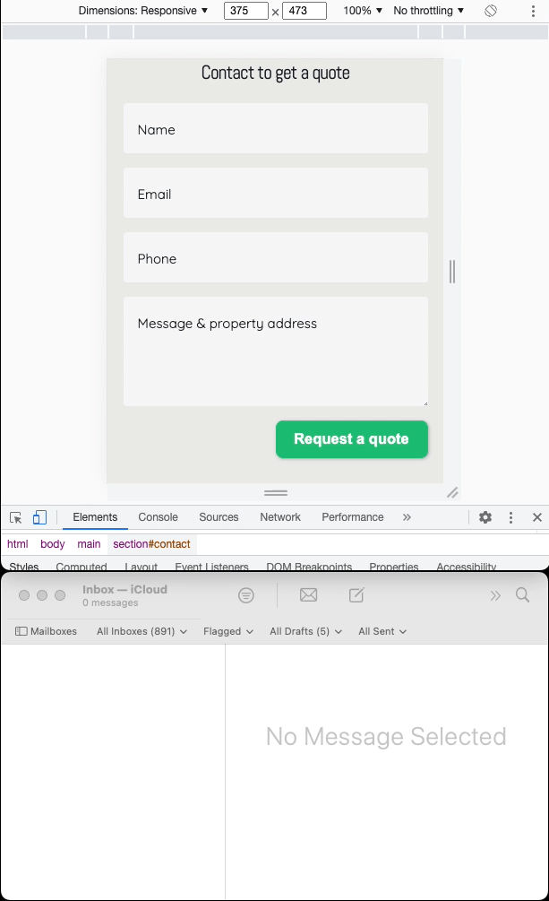

# Corporate landing page

## ATpools
#### 1. Designed using Figma and applied on practice graphic design principles:
- typography
- alignment
- grid
- color theory
- composition
- geometry
- contrast  

[Figma prototype file](https://www.figma.com/file/DPXTuZIoryoZcszOXbssIi/pools?node-id=58%3A1871)

#### 2. Implemented in vanilla css, html, js

Home page with light/dark themes and animated email form using express backend. 

#### 3. Gitlab CI pipeline automatically builds and deploys new versions of the application.