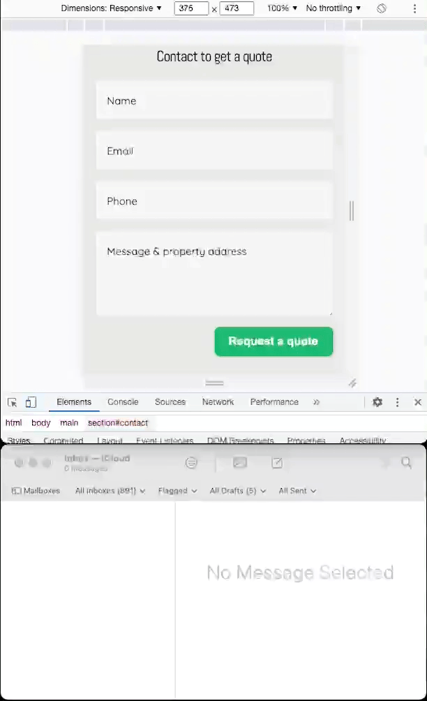

# atpools

## Overview
This is a homepage for a small business owner.

#### Prototyped using Figma, Photoshop, Illustrator and applied on practice graphic design principles:
- typography
- alignment
- grid
- color theory
- composition
- geometry
- contrast  

[Figma prototype file](https://www.figma.com/file/DPXTuZIoryoZcszOXbssIi/pools?node-id=58%3A1871)

#### Implemented in vanilla css, html, js

Home page with light/dark themes and animated email form using express backend. 

#### Gitlab CI pipeline automatically builds and deploys new versions of the application to the cloud compute instance.